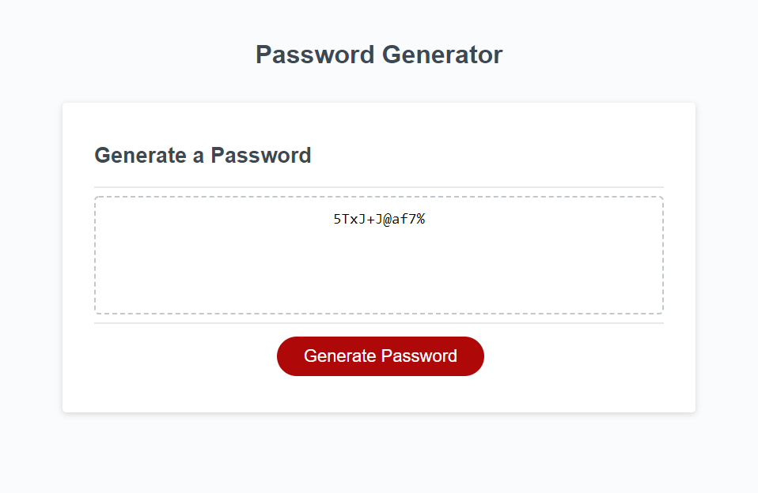

# Password Generator 

## Description 

This was a project that was given to me from the UT Full-Stack Coding Bootcamp. The idea of this project was to create a strong and secure password. 

When you click generate password you will receive mutiple prompts that will appear. You will need to decide how long you want your password to be, however it has to be within 8-128 characters. From then you can decide if you want numbers, lower case, upper case, and special characters in the password. 

Once you have completed all the prompts you should see your password generated in the box!

Congrats you have a new secure password!

[Password Generator](https://cbdavis101.github.io/Javascript-Password/)